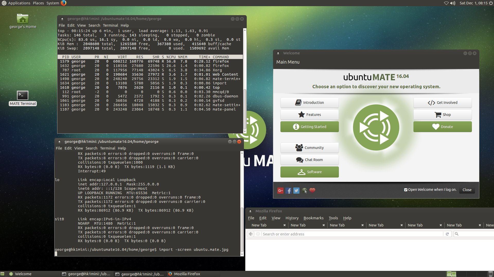

# hk1-mini
Slackware / Ubuntu on hk1 mini

Issue: kernel is not SMP. Use command line paratmeter maxcpus=1 to get system up.
System gets hung as soon as another core is enabled using 
  
    echo 1 > /sys/devices/system/cpu/cpuX/online  or so. 

Slackware 14.2

make a bootable sd card:

## method 1:
        
    dd if=./boot.hk1.mini/idbloader.img of=/dev/sdX seek=$((0x40))
    dd if=./boot.hk1.mini/uboot.img of=/dev/sdX seek=$((0x4000)) conv=notrunc # $((0x4000))
    dd if=./boot.hk1.mini/trust.img of=/dev/sdX seek=$((0x6000)) conv=notrunc # $((0x6000))
  
### create a new partition like:

    Device     Boot  Start      End  Sectors  Id Type
    /dev/sdX1        32768 31116287 31083520  83 Linux
        
    partprobe /dev/sdX
    mkfs.ext4 /dev/sdX1
   
    mount and copy : rk3229-evb.dtb, extlinux/, zImage, initrd-armv7.gz ( for slackware setup )
  
    use appropriate extlinux/extlinux.conf for setup 
  
    Copy Slackware for arm install files to Slackware-14.2
  
    boot to setup
  
    install from pre mounted directory /mnt/slackware-14.2/slackware 
  
    once installation is finished use extlinux/extlinux.conf for slackware.
  
    remember to add either a swap partition or file
  
    reboot!
 
## method 2:
  
    dd if=./sdcard.first10MB.img of=/dev/sdX 
  
    fdisk /dev/sdX and continue as above.
  
  
 ### Ubuntu. using ubuntu-mate 16.04 for raspberry pi:
 
    setup bootable sdcard as above. get ubuntu ubuntu-mate-16.04.2-desktop-armhf-raspberry-pi.img.gz

    /sbin/fdisk -l ./ubuntu-mate-16.04.2-desktop-armhf-raspberry-pi.img
     
    Disk ubuntu-mate-16.04.2-desktop-armhf-raspberry-pi.img: 4.7 GiB, 5000000000 bytes, 9765625 sectors
    Units: sectors of 1 * 512 = 512 bytes
    Sector size (logical/physical): 512 bytes / 512 bytes
    I/O size (minimum/optimal): 512 bytes / 512 bytes
    Disklabel type: dos
    Disk identifier: 0x1d8c09f0

    Device Boot  Start     End  Sectors  Size Id Type
    ubuntu-mate-16.04.2-desktop-armhf-raspberry-pi.img1        2048  131071  129024   63M  c W95 FAT
    ubuntu-mate-16.04.2-desktop-armhf-raspberry-pi.img2      131072 9764863 9633792  4.6G 83 Linux

  
now mount second partition like:

    mount -o loop,offset=$((131072*512)) ubuntu-mate-16.04.2-desktop-armhf-raspberry-pi.img /cdrom -r/cdrom -r  
 
    mount /dev/sdX1 /mnt
    rsync -az /cdrom/ /mnt
    or for multiple distributions on same partition, something like:
    rsync -az /cdrom/ /mnt/ubuntumate16.04/

edit /etc/fstab to remove boot mount, and also change root to /dev/sdX1

    proc            /proc           proc    defaults          0       0
    /dev/mmcblk0p1  /               ext4   defaults,noatime  0       1
    # /dev/mmcblk0p1  /boot/          vfat    defaults          0       2
    /swap.img       swap            swap    defaults        0  0

extlinux same for slackware ( not slackware setup )

remember to add either a swap partition or swap file.

reboot!

### Swap:

    # 2GB
    dd if=/dev/zero of=swap.img count=$((1024*1024*2*2)
    mkswap swap.img
    swapon swap.img

    /etc/fstab:
    /swap.img swap swap defaults 0 0

## Keeping multiple distributions on same SD card:

eg, once slackware is installed and ok:

    mount sdcard to /mnt
    cd /mnt
    mkdir slackware-14.2
    mv * slackware-14.2
    mv slackware-14.2/{zImage, extlinux/, *dtb, initrd*} .
    ln -s slackware-14.2/* .
    sync
    
### similarly move files for other distributions too.

    mount sdcard to /mnt
    cd /mnt
    mkdir ubuntu-mate-16.04
    mv * ubuntu-mate-16.04
    mv ubuntu-mate-16.04/{slackware-14.2, *dtb, zImage, extlinux/, initrd*} .

	or for direct installation to subdir from image:

    rsync -az /cdrom/ ubuntu-mate-16.04

## Debug through serial port

use a PL2303 type usb-serial dongle, connect to the serial port on boar ( need soldering ). see 
[connection](https://github.com/gv1/hk1-mini/hk1.mini+pl2303.jpg.)
using minicom:
        
    port /dev/ttyUSB0
    8n1, 
    HW/SW flow control - no       
    minicom -b 1500000 -C mini.cap

## Log files etc from OS

### Slackware

     
     
   
   
     
   

### Ubuntu

     
     
   
   
   

## Slackware Links:

   
   
   
   
   

## Ubuntu MATE links:

   
   

